<!-- 
     ╭──────────────────────────────────────────────────────╮
     │  github.com/MadtorXD                                │
     │  GitHub's native dark mode palette                   │
     │  #0d1117 · #58a6ff · #3fb950 · #f78166              │
     ╰──────────────────────────────────────────────────────╯
-->

<div align="center">

<!-- ═══════════════════ ANIMATED HEADER SVG ═══════════════════ -->

<a href="https://github.com/MadtorXD">
  
</a>

<br/>

<!-- ═══════════════════ TYPING SVG ═══════════════════ -->

<a href="https://git.io/typing-svg">
  
</a>

<br/>

<!-- ═══════════════════ SOCIAL BADGES ═══════════════════ -->

<a href="https://www.linkedin.com/in/hvtdpt/"></a><a href="mailto:hvtcodes@yahoo.com"></a><a href="https://github.com/MadtorXD"></a>

<br/><br/>


</div>

---

<!-- ═══════════════════ ABOUT ME ═══════════════════ -->

###  &nbsp;About Me

```yaml
Name:          Harsh Vardhan Tripathi
Location:      India 🇮🇳
Education:     B.Tech (IT) — Gautam Buddha University (8.7 / 10)
Current Focus: Building production-grade GenAI apps & AI agents
Open To:       SDE · AI/ML · Product-Tech · Data Engineering
Philosophy:    "Ship fast · learn faster · never stop building"
```

---

<!-- ═══════════════════ TECH ARSENAL ═══════════════════ -->

### 🧰 Tech Arsenal

<table>
<tr>
<td align="center" width="140"><b>🔤 Languages</b></td>
<td>


</td>
</tr>
<tr>
<td align="center" width="140"><b>⚛️ Frontend</b></td>
<td>


</td>
</tr>
<tr>
<td align="center" width="140"><b>🔧 Backend</b></td>
<td>


</td>
</tr>
<tr>
<td align="center" width="140"><b>🤖 AI / GenAI</b></td>
<td>


</td>
</tr>
<tr>
<td align="center" width="140"><b>📊 Data</b></td>
<td>


</td>
</tr>
<tr>
<td align="center" width="140"><b>🛠️ DevTools</b></td>
<td>


</td>
</tr>
</table>

<!-- ═══════════════════ FEATURED PROJECTS ═══════════════════ -->

### 🏆 Featured Projects

<div align="center">

<a href="https://github.com/MadtorXD/podcastr"></a><a href="https://github.com/MadtorXD/BrainMate-AI"></a>

<a href="https://github.com/MadtorXD/ResearchMate-AI"></a><a href="https://github.com/MadtorXD/TaskOrbit"></a>

<a href="https://github.com/MadtorXD/VisualTalk-Junior"></a><a href="https://github.com/MadtorXD/playto-community-feed"></a>

</div>

---

<!-- ═══════════════════ PROJECT DEEP DIVES ═══════════════════ -->

### 🎯 Projects Deep-Dive

<details>
<summary><b>🤖 Podcastr — AI SaaS Podcast Platform</b> &nbsp;<a href="https://podcastr-mini.vercel.app/">Live ↗</a></summary>
<br/>

> **Tech:** `Next.js 14` `TypeScript` `Convex` `OpenAI TTS` `DALL-E 3` `Clerk` `Tailwind CSS` `Shadcn UI`

- Engineered AI-driven SaaS enabling text-to-podcast generation with **6 voice models** via OpenAI TTS API
- Integrated **DALL-E 3** for dynamic thumbnail generation from natural language prompts
- Implemented **Clerk-based authentication** with secure session management and protected API routes
- Built a **fixed-position audio player** with seek, volume, mute — persists across page navigation
- Designed a **real-time discovery engine** with search, filtering by voice type, and trending surfacing
- Deployed on **Convex** for real-time backend with automatic data sync and serverless functions
</details>

<details>
<summary><b>🧠 BrainMate AI — Mental Health Conversational Agent</b></summary>
<br/>

> **Tech:** `Python` `FastAPI` `Streamlit` `LangChain` `LangGraph`

- Built a multi-turn **AI conversational system** using LangChain with structured evaluation of response quality
- Architected a **state-graph workflow** with LangGraph for managing conversation context and therapeutic patterns
- Developed real-time **data processing pipelines** to monitor system performance, response latency, and session metrics
- Implemented **response quality metrics** for reliability tracking and workflow efficiency benchmarking
</details>

<details>
<summary><b>📄 ResearchMate AI — Autonomous Research Paper Synthesizer</b></summary>
<br/>

> **Tech:** `Python` `arXiv API` `PyPDF2` `Streamlit`

- Designed an **autonomous AI agent** that browses, reads, and synthesizes papers into publication-ready output
- Implemented **keyword-based ranking and semantic filtering** achieving ~90% retrieval accuracy
- Built PDF extraction pipelines using PyPDF2 for processing large volumes of research documents at scale
- Automated end-to-end summarization workflows, **reducing manual research effort by ~80%**
</details>

<details>
<summary><b>🎈 VisualTalk Junior — Child AI Voice Companion</b> &nbsp;<a href="https://visual-talk-junior.vercel.app">Live ↗</a></summary>
<br/>

> **Tech:** `React` `Groq (Llama 3.3 70B)` `Web Speech API` `Tailwind CSS` `Framer Motion`

- Built a **real-time voice interaction system** using Web Speech API for ultra-low latency speech recognition
- Integrated **Groq LPU inference** (Llama 3.3 70B) for sub-second AI responses faster than human reactivity
- Implemented **pedagogical scaffolding** — Hook → Contextualization → Prompt → Gentle Correction
- Designed a lexile-appropriate AI persona with **5-7 word sentence constraints** for age 3-5 interaction
</details>

<details>
<summary><b>🚀 TaskOrbit — Kanban Task Board</b> &nbsp;<a href="https://taskorbit-chi.vercel.app/">Live ↗</a></summary>
<br/>

> **Tech:** `React 19` `Vite` `@dnd-kit` `Context API` `Vitest`

- Engineered a **3-column Kanban board** with full CRUD, drag-and-drop (via @dnd-kit), and localStorage persistence
- Built a **real-time search dropdown** with matching results, color-coded status dots, and priority badges
- Implemented **centralized state management** via Context API with memoized derived state
- Added an **Error Boundary** with automatic recovery UI and storage cleanup
- **12 passing tests** using Vitest + React Testing Library covering auth, CRUD, and rendering
</details>

<details>
<summary><b>💬 Playto Community Feed — Scalable Social Feed Engine</b> &nbsp;<a href="https://playto-assignment.netlify.app/">Live ↗</a></summary>
<br/>

> **Tech:** `Django REST Framework` `React` `PostgreSQL` `Docker`

- Solved the **N+1 query problem** for nested comments using O(1) in-memory adjacency-list tree reconstruction
- Implemented a **24-hour rolling karma leaderboard** using split-and-merge aggregate queries
- Built **polymorphic voting** via GenericForeignKey with idempotent API and `unique_together` constraints
- Designed a recursive React UI handling **unlimited comment nesting** without performance degradation
</details>

<details>
<summary><b>⚡ EnergyGrid — IoT Data Aggregator with Rate-Limit Handling</b></summary>
<br/>

> **Tech:** `Node.js` `REST API` `Batch Processing`

- Built a Node.js client aggregating data from **500 IoT devices** against a rate-limited API (1 req/sec)
- Implemented **intelligent batching** (groups of 10) reducing total API calls from 500 → 50
- Designed **exponential backoff retry logic** for automatic recovery from 429 responses
- Serial processing with deliberate delays to respect API limits while maintaining data integrity
</details>

---

<!-- ═══════════════════ GITHUB ANALYTICS ═══════════════════ -->

### 📊 GitHub Analytics

<!-- ℹ️ These stats are DYNAMIC — they auto-update from GitHub's API every time someone views your profile -->

<div align="center">


<br/>


<br/>


</div>

---

<!-- ═══════════════════ CERTIFICATIONS ═══════════════════ -->

### 📜 Certifications

<table>
<tr>
<td align="center" width="80">

</td>
<td>
<a href="https://drive.google.com/file/d/1zeHRxnGSB85wg6DaG_u67pI51XioSqAm/view?usp=drive_link"><b>Programming Using Java</b></a> — Infosys Springboard
</td>
</tr>
<tr>
<td align="center" width="80">

</td>
<td>
<a href="https://drive.google.com/file/d/1zLYunIjEjvm4ReSSewo86AsnW7WqRUFb/view?usp=drive_link"><b>Introduction to Cybersecurity</b></a> — Infosys Springboard
</td>
</tr>
</table>

---

<!-- ═══════════════════ CURRENTLY ═══════════════════ -->

### 🔭 Currently

```
🧠  Deep-diving into Generative AI — building agents, RAG pipelines & real-time AI apps
⚡  Shipping production-ready projects every month that solve real problems
🎯  Open to SDE · AI/ML · Product-Tech · Data Engineering roles
📬  Let's connect → hvtcodes@yahoo.com | linkedin.com/in/hvtdpt
```

---

<!-- ═══════════════════ CONTRIBUTION SNAKE ═══════════════════ -->

<div align="center">
  <picture>
    <source media="(prefers-color-scheme: dark)" srcset="https://raw.githubusercontent.com/platane/snk/output/github-contribution-grid-snake-dark.svg" />
    <source media="(prefers-color-scheme: light)" srcset="https://raw.githubusercontent.com/platane/snk/output/github-contribution-grid-snake.svg" />
    
  </picture>
</div>

---

<!-- ═══════════════════ QUOTE ═══════════════════ -->

<div align="center">
  
</div>

---

<!-- ═══════════════════ FOOTER SVG ═══════════════════ -->

<div align="center">
  
</div>
